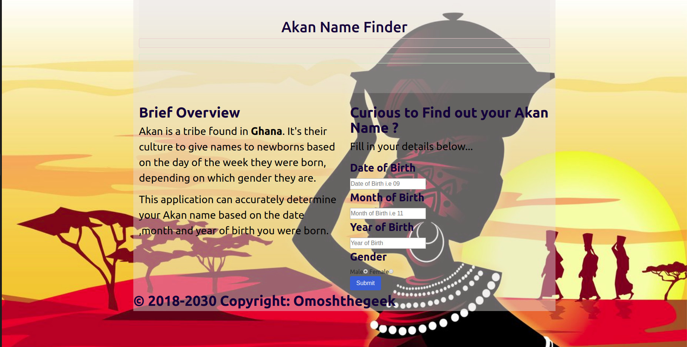

### PROJECT NAME
- AKAN NAMES

## PROJECT DESCRIPTION
- Akan is a tribe found in Ghana. It's their culture to give names to newborns based on the day of the week they were born, depending on which gender they are.  This application can accurately determine your Akan name based on the date ,month and year of birth .
## CONTRIBUTORS NAME
 - Elvin Omonche
#
## TECHNOLOGY USED
- HTML
  - used HTML to display the Content .
- CSS
   - Used CSS and Bootstrap css for styling .
- JAVASCRIPT
   - Used Javascript to make the web interactive

## Contact information
 - For queries ,comments compliments etc ,feel free to reach out to OmoshtheGeek on the following platforms
    #### Twitter :
    * ###### @elvizoh

    #### Facebook :
    * ###### @Elvin Omoxh

    #### Telegram :
    * ###### @omoshthegeek

    #### WhatsApp :
    * ###### @ +254735027537

     #### Slack:
    * ###### @ Elvin Omonche

    #### Git HUb :
    * ###### @omoshthegeek254

## LICENSE 
 
  

##  Screen Shots
  - Below is the screen shots of the projects

  - 